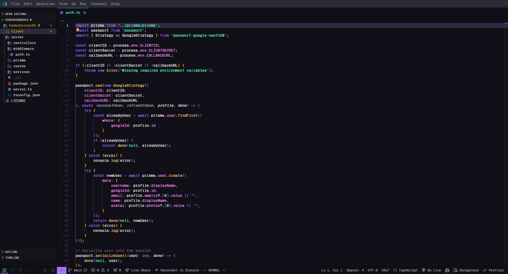

<samp><b>Nick's VSCode / Vim settings </b></samp>

[`.vscode_with_vim_settings/settings.json`](./vscode_with_vim_settings/settings.json)<br>
[`.vscode_with_vim_settings/extensions.json`](./vscode_with_vim_settings/extensions.txt)<br>
[`.vscode_with_vim_settings/keybindings.json`](./vscode_with_vim_settings/keybindings.json)

<br>
<br>

<p align="center"><samp>Preview</samp></p>



## Run the following command to install all the extensions:

Run this in the correct directory where **extension.txt** is 

```
Get-Content extensions.txt | ForEach-Object {code --install-extension $_}
```

## Make sure you install the Geist Mono font [`Geist Mono`](https://vercel.com/font)<br>

<p align = "center">
<sub><samp>&nbsp;&nbsp;&nbsp;&nbsp;&nbsp;&nbsp;&nbsp;&nbsp;&nbsp;Theme | <a href="https://github.com/daltonmenezes/aura-theme">Aura-Theme</a><br>
&nbsp;&nbsp;&nbsp;&nbsp;&nbsp;&nbsp;&nbsp;Font | <a href="https://vercel.com/font">Geist Mono</a><br>
&nbsp;&nbsp;&nbsp;&nbsp;&nbsp;&nbsp;&nbsp;File Icons | <a href="https://github.com/moxer-theme/moxer-icons-code">Moxer-Icons</a><br>
&nbsp;&nbsp;&nbsp;&nbsp;&nbsp;&nbsp;&nbsp;Custom UI | <a href="https://github.com/drcika/apc-extension">Apc Customize UI++</a><br>
</p>

<br>

## LICENSE

MIT